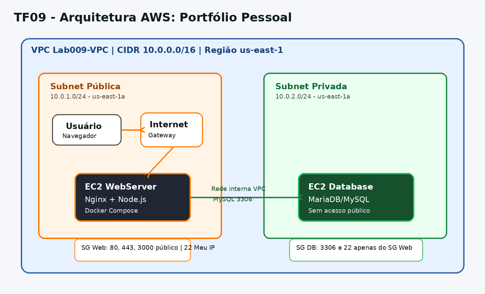

# TF09 - Portfólio Pessoal na AWS

**Aluno:** Riquelme Menezes  
**RA:** 6324064  
**Disciplina:** Implementação de Sistemas  
**Curso:** Análise e Desenvolvimento de Sistemas - UniFAAT  

---

## 1. Visão Geral

Este trabalho implementa um sistema de portfólio pessoal hospedado na AWS, utilizando uma arquitetura segura com EC2, VPC customizada, subnet pública, subnet privada, Security Groups e banco de dados em rede privada.

A aplicação possui:

- Frontend responsivo com informações pessoais, habilidades e projetos.
- Backend em Node.js/Express com API REST.
- Banco de dados MariaDB/MySQL para armazenar projetos e experiências.
- Health check para validar a conexão entre aplicação e banco.
- Nginx como servidor web e proxy reverso.
- Docker Compose para execução dos containers.

---

## 2. Arquitetura

A arquitetura foi criada com uma VPC customizada contendo uma subnet pública e uma subnet privada. O Web Server fica exposto publicamente para acesso HTTP, enquanto o banco de dados permanece protegido na subnet privada, acessível apenas pela aplicação.



### Fluxo da aplicação

```text
Usuário/Navegador
        |
        | HTTP porta 80
        v
EC2 WebServer - Subnet Pública
Nginx + Backend Node.js
        |
        | Porta 3306 liberada apenas via Security Group
        v
EC2 Database - Subnet Privada
MariaDB/MySQL
```

---

## 3. Arquitetura de Rede

### VPC Configuration

- **CIDR Block:** 10.0.0.0/16
- **Região:** us-east-1
- **VPC:** Lab009-VPC

### Subnets

- **Public Subnet:** 10.0.1.0/24 - us-east-1a
- **Private Subnet:** 10.0.2.0/24 - us-east-1a

### Routing

- **Public Route Table:** rota `0.0.0.0/0` apontando para o Internet Gateway `Lab009-IGW`.
- **Private Route Table:** sem rota pública permanente para internet após a configuração do banco.

---

## 4. Segurança Implementada

A segurança foi implementada com Security Groups separados para o servidor web e para o banco de dados, aplicando o princípio do menor privilégio.

### Security Group do Web Server

| Tipo | Porta | Origem | Justificativa |
|---|---:|---|---|
| SSH | 22 | Meu IP /32 | Administração segura da instância |
| HTTP | 80 | 0.0.0.0/0 | Acesso público à aplicação |
| HTTPS | 443 | 0.0.0.0/0 | Preparado para acesso seguro via HTTPS |
| TCP Customizado | 3000 | 0.0.0.0/0 | Testes diretos da API/backend |

### Security Group do Database

| Tipo | Porta | Origem | Justificativa |
|---|---:|---|---|
| MySQL/Aurora | 3306 | Security Group do Web Server | Permite acesso ao banco apenas pela aplicação |
| SSH | 22 | Security Group do Web Server | Administração interna via bastion/ProxyJump |

### Key Pair e SSH

- Foi utilizado o Key Pair `Lab009-KeyPair`.
- A chave privada foi mantida localmente no computador do aluno.
- O acesso SSH direto foi restrito ao IP autorizado do aluno.
- O acesso à instância privada do banco foi realizado por meio da WebServer, funcionando como ponto intermediário de acesso.

---

## 5. Tecnologias Utilizadas

- **AWS EC2:** hospedagem das instâncias.
- **AWS VPC:** isolamento da rede.
- **Subnets pública e privada:** separação entre aplicação e banco.
- **Security Groups:** controle de acesso por porta e origem.
- **Amazon Linux 2023:** sistema operacional das instâncias.
- **Docker e Docker Compose:** empacotamento e execução da aplicação.
- **Nginx:** servidor web e proxy reverso.
- **Node.js + Express:** API backend.
- **MariaDB/MySQL:** banco de dados relacional.
- **HTML, CSS e JavaScript:** frontend responsivo.

---

## 6. Como Executar a Aplicação

Na instância WebServer:

```bash
cd ~/app
sudo docker-compose up -d --build
sudo docker-compose ps
```

Testar o backend diretamente:

```bash
curl http://localhost:3000/health
```

Testar via Nginx:

```bash
curl http://localhost/health
```

Testar API pública:

```bash
curl http://IP_PUBLICO_DA_WEBSERVER/api/info
curl http://IP_PUBLICO_DA_WEBSERVER/health
```

---

## 7. Endpoints da API

| Método | Endpoint | Descrição |
|---|---|---|
| GET | `/health` | Verifica status da aplicação e banco |
| GET | `/api/info` | Retorna informações da instância |
| GET | `/api/projects` | Lista projetos |
| POST | `/api/projects` | Cria novo projeto |
| PUT | `/api/projects/:id` | Atualiza projeto |
| DELETE | `/api/projects/:id` | Remove projeto |
| GET | `/api/experiences` | Lista experiências/habilidades |

---

## 8. Evidências de Funcionamento

As evidências foram salvas na pasta `evidencias/`.

### Evidências de infraestrutura

- VPC customizada `Lab009-VPC`.
- Subnet pública `Lab009-Public-Subnet`.
- Subnet privada `Lab009-Private-Subnet`.
- Internet Gateway `Lab009-IGW` anexado à VPC.
- Route Table pública com rota `0.0.0.0/0` para o Internet Gateway.
- Security Groups do WebServer e do Database.
- Instâncias EC2 `Lab009-WebServer` e `Lab009-Database` em execução durante os testes.

### Evidências da aplicação

- Página frontend acessível pelo navegador.
- Endpoint `/api/info` respondendo publicamente.
- Endpoint `/health` retornando `healthy`.
- Docker Compose com containers `app` e `nginx` em execução.
- Logs da aplicação.
- Teste de conexão da WebServer com o banco privado pela porta `3306`.

Exemplo de resposta do health check:

```json
{
  "status": "healthy",
  "database": "connected",
  "server": "EC2"
}
```

---

## 9. Custos Estimados

A infraestrutura foi planejada para utilizar o Free Tier da AWS sempre que possível.

| Recurso | Tipo | Estimativa |
|---|---|---|
| EC2 WebServer | t3.micro | Free Tier, se elegível |
| EC2 Database | t3.micro | Free Tier, se elegível |
| EBS | Volume padrão | Dentro do limite Free Tier, se elegível |
| VPC/Subnets/Security Groups | AWS Network | Sem custo direto |
| Elastic IP | Temporário | Deve ser liberado após uso para evitar cobrança |

> Observação: o Elastic IP foi utilizado temporariamente para permitir instalação de pacotes na instância privada e, após o uso, foi desassociado e liberado.

---

## 10. Limpeza de Recursos e Controle de Custos

Após a validação da aplicação e a coleta das evidências, os recursos utilizados na AWS foram removidos para evitar cobranças desnecessárias.

Foram limpos os seguintes recursos:

- Instância EC2 `Lab009-WebServer`.
- Instância EC2 `Lab009-Database`.
- Elastic IP temporário utilizado na configuração do banco.
- Security Groups do Web Server e Database.
- Internet Gateway.
- Subnets pública e privada.
- Route Tables criadas para o laboratório.
- VPC customizada `Lab009-VPC`.
- Key Pair `Lab009-KeyPair`.

A limpeza foi validada pelo AWS CLI, confirmando que as instâncias ficaram com estado `terminated` e que não restaram Elastic IPs, subnets, Internet Gateway ou Security Groups associados ao Lab009.

### Comando utilizado para validar as instâncias

```bash
aws ec2 describe-instances \
  --filters "Name=tag:Name,Values=Lab009*" \
  --query "Reservations[].Instances[].{Nome:Tags[?Key=='Name']|[0].Value,Estado:State.Name,ID:InstanceId}" \
  --output table
```

### Resultado obtido

```text
-----------------------------------------------------------
|                    DescribeInstances                    |
+------------+-----------------------+--------------------+
|   Estado   |          ID           |       Nome         |
+------------+-----------------------+--------------------+
|  terminated|  i-03fbed61dcd350655  |  Lab009-WebServer  |
|  terminated|  i-08678010fffaeab21  |  Lab009-Database   |
+------------+-----------------------+--------------------+
```

### Comandos adicionais de conferência

```bash
aws ec2 describe-subnets \
  --filters "Name=tag:Name,Values=Lab009*" \
  --query "Subnets[].{Nome:Tags[?Key=='Name']|[0].Value,SubnetId:SubnetId,CIDR:CidrBlock}" \
  --output table
```

```bash
aws ec2 describe-internet-gateways \
  --filters "Name=tag:Name,Values=Lab009-IGW" \
  --query "InternetGateways[].{Nome:Tags[?Key=='Name']|[0].Value,ID:InternetGatewayId}" \
  --output table
```

```bash
aws ec2 describe-addresses \
  --query "Addresses[].{IP:PublicIp,AllocationId:AllocationId,AssociationId:AssociationId}" \
  --output table
```

Nos comandos de conferência de subnets, Internet Gateway e Elastic IP, não houve retorno de recursos associados ao Lab009, indicando que os recursos foram removidos corretamente.

---

## 11. Conclusão

O TF09 foi concluído com sucesso. A aplicação de portfólio pessoal foi hospedada em uma instância EC2 pública, utilizando Nginx, Docker Compose e backend Node.js/Express. O banco de dados MariaDB foi configurado em uma instância privada, acessível somente pela WebServer através de regras específicas de Security Group.

A arquitetura implementada demonstrou o uso de VPC, subnets pública e privada, roteamento, Security Groups, controle de acesso SSH, health checks e boas práticas de limpeza de recursos para evitar custos adicionais.
